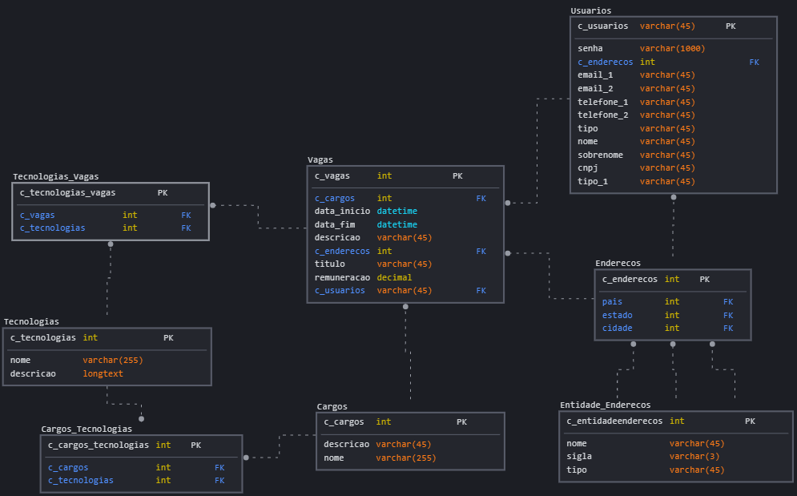

# Rotas
## Vagas :briefcase:
> Rotas usadas para manipular objetos do tipo Vaga

`vagas/listar` : lista vagas filtradas de acordo com os parametros da requisição

    GET - Paramêtros da requisição:

        - id: Retorna  vaga especificada pelo id
        - usuario_id: lista todas as vagas de um usuario
        - cargo_id: lista todas as vagas associadas a um determinado cargo
        - tecnologia_id: lista todas as vagas associadas a uma determinada tecnologia
        - data_inicio: lista todas as vagas a partir de uma determinada data de inicio
        - data_fim: lista todas as vagas até uma determinada data de fim
        - endereco: Lista todas as vagas com endereço parecido ao informado
        - remuneracao: lista todas as vagas com uma remuneração maior igual que a informada
        - sem paramêtros: lista todas as vagas do sistema
        - titulo: busca todas as vagas com o titulo parecido ao informado
        - cargo_nome: busca todas as vagas com o nome do cargo parecido ao informado
        - tecnologia_nome: busca todas as vagas com nome das tecnologias parecidas à informada
        - usuario_nome: busca todas as vagas com o nome da empresa parecido ao informado

`vagas/`: 

    GET - Paramêtros da requisição:

        - id: Obtem a vaga especificada pelo id e lista todos os que se candidataram à  vaga

    POST: cria uma vaga e retorna seu id

    PUT - Corpo da requisição:

        - tec_id: adiciona uma tecnologia a uma vaga
        - cargo_id: muda a vaga com o cargo especificado
        - cidade: muda a cidade do endereço da vaga
        - estado: muda o estado do endereço da vaga
        - pais: muda o país do endereço da vaga
        - remuneracao: muda a remuneracao da vaga 
        - data_inicio: muda a data de inicio da vaga
        - data_fim:muda a data de fim da vaga

    DELETE - Corpo da requisição:

        - vaga_id: Excluí a vaga especificada

## Usuários :busts_in_silhouette:

`vagas/usuario/`:

    GET - Paramêtros da requisição:

        - id:  Retorna as informações públicas do usuário informado
        - sem parametro: Retorna as informações do usuário logado

    PUT: Atualiza as informações do usuário logado

    

`vagas/usuario/cadastrar`:

    POST: Cria um usuário e o retorna

`vagas/api-token`:

    POST loga um usuário no sistema - Corpo da requisição:

        - username: o username do usuário
        - password: a senha do usuário

        retorna um token de autenticação

`vagas/usuario/logout`:

    POST: desloga o usuário do sistema

`vagas/usuario/senha/editar`:
    
    POST: Altera a senha do usuário logado

`vagas/usuario/senha/esquecer/`:
    
    POST - Corpo da requisição:
        - username: Envia um email para o usuário informado em username com a nova senha gerada pela sistema

## Cargos
`vagas/cargo/buscar`:

GET - Paramêtros da requisição:

        - cargo_id : Retorna o cargo especificado
        - tec_id: Retorna cargos que possuem a tecnologia informada pelo id
        - nome: Retorna cargos que possuem nomes semelhantes ao informado

`vagas/cargo`:

> Metodos abaixo disponíveis somente para o adiministrador do sistema

    DELETE- Corpo da requisição:

        -id: Excluí o cargo

    POST: Cria um cargo e o retorna

    PUT - Corpo da requisição:
        
        - id: Atualiza as informações do cargo

## Tecnologia

`vagas/tec`:

    GET - Paramêtros da requisição:
        
        - id: Retorna a tecnologia especificada
        - nome: Retorna tecnologias que possuem nomes semelhantes ao informado

> Metodos abaixo disponíveis somente para o adiministrador do sistema

    DELETE - Corpo da requisição:
        
        - id: Excluí a tecnologia

    POST: Cria uma tecnologia e a retorna

    PUT - Corpo da requisição:
        
        - id: Atualiza as informações da tecnologia

## Endereço

`vagas/endereco/`:

    GET - Paramêtros da requisição:

        - id: Retorna o endereço especificado
        - nome: Retorna iendereço com nomes semelhantes ao informado

> Metodos abaixo disponíveis somente para o adiministrador do sistema

    DELETE - Corpo da requisição:

        - id: Excluí o endereço

    POST - Corpo da requisição:
        
        - endereco: Cria um endereço e o retorna

# Organização do banco de dados
